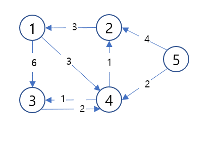

**dijkstra(다익스트라) 알고리즘**

시작점에서 모든 정점으로의 최단 경로를 구하는 알고리즘

**설명**

>다익스트라 알고리즘과 플로이드 와샬 알고리즘은 상당히 흡사합니다.

위의 그래프에서 출발점을 5번 노드로 정하고, 
5번 노드에서 각 노드로 가는 최소 비용을 구해 이차원 배열로 그려보면 아래와 같습니다.
(아직 계산되지 못하거나 갈수 없는 노드의 경우엔 INF로 표시됩니다.)

| 1   | 2  | 3   | 4  | 5  |
|:----|:---|:----|:---|:---|
| INF | 4  | INF | 2  | 0  |

위 테이블에서 5번 노드에서 2번 노드로 가는 최소 비용은 4입니다.
하지만 5번 노드에서 출발하여 4번 노드를 경유, 2번 노드로 도착하는 경로(5 -> 4 -> 2)를 그려보면 3이라는 비용이 나옵니다.

| 1   | 2                           | 3                           | 4  | 5  |
|:----|:----------------------------|:----------------------------|:---|:---|
| INF | 3 :triangular_flag_on_post: | 3 :triangular_flag_on_post: | 2  | 0  |

더해서 4번 노드를 경유하여 3번 노드에 도착한다면 3의 비용이 계산되죠.
이러한 식을 반복하여 모든 정점으로의 최소 비용을 구하는 것이 다익스트라 알고리즘입니다.
하지만 이것을 도식화를 하기 위해선 '4번 노드'를 경유하기로 했던 선택을 논리적으로 변경해줘야 합니다

다른 '최소 비용'이 만들어지기 위해선 이전의 경로 혹은 방법이 최소의 비용을 가지고 있어야 가능합니다.
그리고 최소 비용을 계산한 테이블 중 가장 적은 비용을 가지고 있는건 4번 노드입니다.

또한 다익스트라 알고리즘에서 놓치지 말아야 할것은 한번 방문한 노드에 다시 방문을 하기 시작하면 무한 루프에 빠지게 된다는 점입니다.

**구현**

구현은 이차원 배열을 전부 탐색해가는 방식과 heap 구조를 사용한 방식 두 가지가 있습니다.
