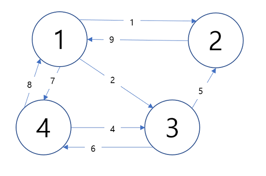

**플로이드 와샬(Floyd Warshall)**

모든 정점에서 모든 정점으로의 최단 경로를 구하는 알고리즘

**설명**

위의 그래프(노드와 다른 노드로 가는 비용을 그려낸)를 이차원 배열의 형태로 바꾸면
다음과 같습니다.

|    |    |    |    |    |
|:---|:---|:---|:---|:---|
|    | 0  | 1  | 2  | 7  |
|    | 9  | 0  | 무한 | 무한 |
|    | 무한 | 5  | 0  | 6  |
|    | 8  | 무한 | 4  | 0  |

이 테이블은 현재 그래프에서 계산되어 있는 노드에서 노드로의 최단 경로를
의미합니다. 그리고 아직 계산되지 않았거나 갈 수 없는 노드의 경우엔 '무한' 혹은
'INF'라고 표현됩니다.

플로이드 와샬 알고리즘은 이러한 이차원 배열을 '거쳐간다'라는 개념으로 반복적으로
갱신하여 최종적으론 모든 경로의 최소 비용을 구해줍니다.

**1. 노드 1을 거쳐가는 경우**

|    |    |                              |                              |                              |
|:---|:---|:-----------------------------|:-----------------------------|:-----------------------------|
|    | 0  | 1                            | 2                            | 7                            |
|    | 9  | 0                            | 무한 :triangular_flag_on_post: | 무한 :triangular_flag_on_post: |
|    | 무한 | 5 :triangular_flag_on_post:  | 0                            | 6 :triangular_flag_on_post:  |
|    | 8  | 무한 :triangular_flag_on_post: | 4 :triangular_flag_on_post:  | 0                            |

깃발이 표기된 6개의 공간을 갱신해주면 됩니다. (노드1이니 X, Y가 1인 라인을
제외한 나머지죠) 공간을 갱신하는 식은 다음과 같습니다.

**X에서 Y로 가는 최소 비용 vs X에서 노드 1로 가능 비용 + 노드 1에서 Y로 가는 비용**

1을 거쳐서 가는 경우가 더 빠른 경우가 존재한다면 빠른 경우로 최소 비용을
갱신해주는 식이죠.
예를 들어 (2, 3)의 최소 비용은 (2, 3) vs (2, 1) + (1, 3)이 되어 (2, 3)의
최소 비용은 11이 됩니다.

위의 식을 반복하여 테이블을 갱신하면

|    |    |                             |                              |                              |
|:---|:---|:----------------------------|:-----------------------------|:-----------------------------|
|    | 0  | 1                           | 2                            | 7                            |
|    | 9  | 0                           | 11 :triangular_flag_on_post: | 16 :triangular_flag_on_post: |
|    | 무한 | 5 :triangular_flag_on_post: | 0                            | 6 :triangular_flag_on_post:  |
|    | 8  | 9 :triangular_flag_on_post: | 4 :triangular_flag_on_post:  | 0                            |

이렇게 됩니다. 그리고 다음엔 노드 2를 거쳐서 그 다음엔 노드 3, 노드 4를 거쳐서
가는 경우에도 위와 같이 반복하면 정말 갈수 없는 경우를 제외한다면 모든 경우에 대해
최소 비용이 구해지게 됩니다.
